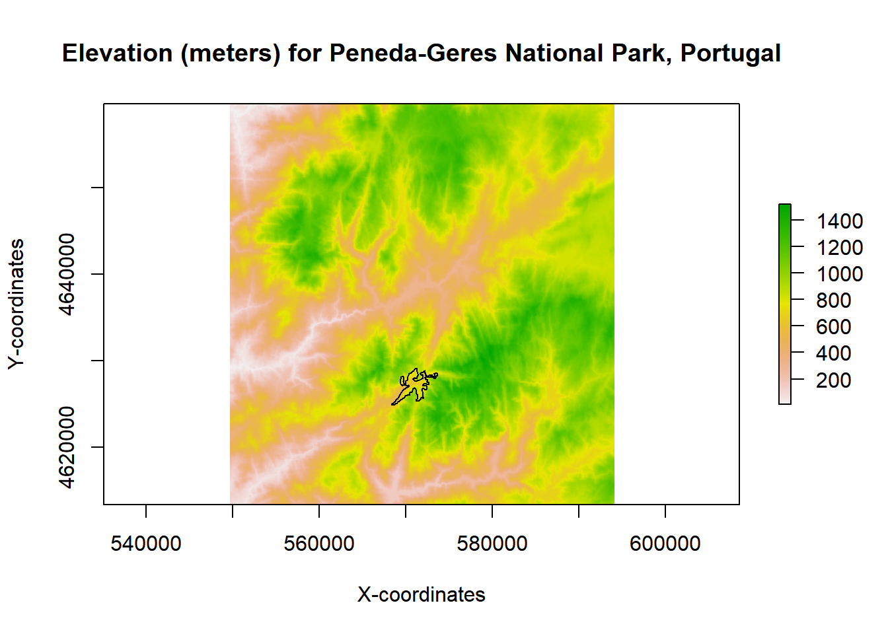

```{r setup, include=FALSE}

knitr::opts_chunk$set(echo = TRUE)
knitr::opts_chunk$set(fig.path = "img/")

```

## Background

-------------------------------------------------------------------------------------------------------


Geospatial data is becoming increasingly used to solve numerous 'real-life' problems (check out some examples [here](http://gisgeography.com/gis-applications-uses/)). In turn, R is becoming more equipped than ever to 
handle this type of data thus providing an exceptional open-source solution to solve many problems in the 
Geographic Information Sciences and Remote Sensing domains. 

In general two types of geospatial data models are used to represent, visualize and model spatial 
phenomena, these are: 

- __Vector data__: which represents the world in three simple geometries: __points__, __lines__ 
and __polygons__. As such, it allows to represent spatial phenomena or variables that are typically 
discrete and with  well-defined boundaries (e.g., touristic points-of-interest, gas stations, 
rivers, roads, drainage basins, country GDP).

- __Raster data__: provides support for representing spatial phenomena by diving the surface 
into a grid (or matrix) composed by cells of regular size. Each raster dataset has a certain 
number of columns and rows and each cell contains a value with information for the variable of 
interest. Stored data can be either: (i) thematic - representing a _discrete_ variable (e.g., 
land cover classification map) or _continuous_ (e.g., elevation).

Choosing the appropriate data model to use depends on the domain of application and the specific 
problem at hand. Typically, people from the social sciences tend to use more the vector data model. 
R packages such as __sp__ or __sf__ (a relatively new package, starting in 2016), provide support for 
this type of data. In contrast, in the environmental sciences the raster data model is more often 
used because of satellite data or the need to represent spatially continuous phenomena such as 
pollution levels, temperature or precipitation values, the abundance or habitat suitability for 
a species among many other. The __raster__ package, introduced in March 2010 by Robert Hijmans 
& Jacob van Etten, currently provides many useful functions for using this type of data. Despite 
these differences, GIS specialists and researchers often use both data models to tackle their 
problems.

Throughout these posts we will cover the basics, intermediate and some advanced stuff in 
__raster data__ handling, manipulation and modelling in R. Examples will be given along with 
the tutorials. Some exercises, with different difficult levels, will be provided so you can 
practice.

The `raster` package currently provides an extensive set of functions to create, read, export, 
manipulate and process raster datasets.It also provides low-level functionalities for creating 
more advanced processing chains as well as the ability to manage large datasets. For more 
information see: `vignette("functions", package = "raster")`.    

This first post on raster data is divided in two sub-sections:        
    (i) accessing raster attributes, and, ([go-to](#rstAttrib))        
    (ii) viewing raster values and calculating simple statistics ([go-to](#rstValues)).        


First we need to install the `raster` package (as well as `sp` and `rgdal`): 

```{r P1_install_packages, message=FALSE, warning=FALSE}


if(!("rgdal" %in% installed.packages()[,1]))
  install.packages(c("rgdal"), dependencies = TRUE)

if(!("sp" %in% installed.packages()[,1]))
  install.packages(c("sp"), dependencies = TRUE)

if(!("raster" %in% installed.packages()[,1]))
  install.packages(c("raster"), dependencies = TRUE)

library(rgdal)
library(sp)
library(raster)


```

Next, download and unzip the sample data. We will use 
[SRTM - version 4.1](http://www.cgiar-csi.org/data/srtm-90m-digital-elevation-database-v4-1) 
elevation data (in meters a.s.l.) for the Peneda-Geres National Park - Portugal ([+info](https://en.wikipedia.org/wiki/Peneda-Ger%C3%AAs_National_Park)) in the examples. 

```{r P1_download_data, echo=TRUE, message=FALSE, warning=FALSE}

# If you run it download problems try changing: method = "wget"

download.file("https://raw.githubusercontent.com/joaofgoncalves/R_exercises_raster_tutorial/master/data/srtm_pnpg.zip", "./data-raw/srtm_pnpg.zip", method = "auto")

unzip("./data-raw/srtm_pnpg.zip", exdir = "./data-raw")


``` 

## Raster attributes <a name="rstAttrib"></a>

-------------------------------------------------------------------------------------------------------

In the first part (of two) of this tutorial we will focus on reading raster data and accessing its core 
attributes.      

After finishing the download, load the data into R using the `raster` function (see `?raster` for more details). 
Then use `print` to inspect the "essential" attributes of the dataset.

```{r P1_load _and_print}

# In this example the function uses a string with the data location
rst <- raster("./data-raw/srtm_pnpg.tif")

# Print raster attributes
print(rst)

```

From the above we can see some important information about our raster dataset. Given that we 
used `raster` function for data loading, we have now created a `RasterLayer`, i.e., a raster object 
with a single layer. We can also see its dimension: __579__ rows, __555__ columns and the pixel size 
in x and y dimensions, a.k.a. the __spatial resolution__, equal to 80m (we are using a projected coordinate 
 system with units in meters; more on this below). 

We can use the function `inMemory` to check if the raster dataset is currently stored on RAM:

```{r P1_in_mem}

inMemory(rst)

```

As we can see, the raster data is currently stored in disk so, at this point, our `RasterLayer` object 
is actually "made of" metadata and a link to the actual raster data on disk. This allow to preserve RAM 
space.       

The package also provides several functions to access each raster attribute individually. 

```{r P1_raster_attrib}

## Raster layer name(s) / more useful for multi-layer rasters
## By default coincides with the file name without extension
names(rst)

## Number of rows, columns and layers
dim(rst)

## Nr of rows
nrow(rst)

# Nr of columns
ncol(rst)

## Total number of grid cells
ncell(rst)

## Spatial resolution in x and y dimensions
res(rst)

## Data type - see ?dataType for more details
dataType(rst)

## Extent (returns a S4 object of class "Extent")
extent(rst)
```


Info on extent coordinates can be retrieved individually:

```{r P1_extent_coords}

xmin(rst)

xmax(rst)

ymin(rst)

ymax(rst)

```


Finally, we can also see info about the Coordinate Reference System (CRS) used to represent the 
data. Many different CRS are used to describe geographic data depending on the location, extent, time, 
domain (among other features) of the collected data.

```{r P1_raster_crs_info}

crs(rst)

```


For the raster package, a __proj4string__ is used to set and define the CRS of the data. This string contains 
some important details of the CRS, such as the _Projection_, the _Datum_, the _Ellipsoid_ and the _units_ 
(e.g., meters, degree). You can see more info on _proj4_ parameters [here](http://proj4.org/parameters.html). 
Use the site [spatialreference.org](http://spatialreference.org/) to find the appropriate _proj4string_ 
(or other information) for the CRS of your choice.


## Raster values <a name="rstValues"></a>

-------------------------------------------------------------------------------------------------------

__.: Summary statistics__

For the second and, last part, of this tutorial we are going to explore raster functions for visualizing, 
summarizing and accessing/querying values at specific locations.

To visualize the data we can simply use the function `plot`.

```{r P1_raster_plot, include=FALSE}

plot(rst, main="Elevation (meters) for Peneda-Geres National Park, Portugal", 
     xlab="X-coordinates", ylab="Y-coordinates")

```


We can also use a histogram to visualize the distribution of elevation values in the sample data.

```{r P1_raster_hist, message=FALSE, warning=FALSE, include=FALSE}

# Generate histogram from a sample of pixels (by default 100K are randomly used)
hist(rst, col="light grey", main = "Elevation (meters a.s.l.)", prob = TRUE, 
     xlab = "Elevation (meters)")

# Generate the density plot object and then overlap it
ds <- density(rst, plot = FALSE)
lines(ds, col = "red", lwd = 2)

```


Calculating summary statistics is fairly easy using the `raster` package. The generic method `summary` is 
available for this type of object (note: this function will use a sample of pixels to calculate statistics).

```{r P1_cell_summary}

summary(rst)

```


Minimum and maximum values can be calculated with the following functions (no sample employed):

```{r P1_min_max_values}
## Min
minValue(rst)

## Max
maxValue(rst)

```


The package also provides a more general interface to calculate cell statistics using the `cellStats` 
function (no sample employed).

```{r P1_cell_stats}

## Mean
cellStats(rst, mean)
## Standard-deviation
cellStats(rst, sd)

## Median
cellStats(rst, median)
## Median-absolute deviation (MAD)
cellStats(rst, mad)

## Quantiles
## 5%, 25%, 50%, 75% and 95%
cellStats(rst, function(x,...) quantile(x, probs=c(0.05, 0.25, 0.5, 0.75, 0.95),...))

```

`cellStats` does not use a random sample of the pixels to calculate hence it will fail (gracefully) 
for very large `Raster*` objects except for certain predefined functions: `sum`, `mean`, `min`, 
`max`, `sd`, `'skew'`, and `'rms'`.     


__.: Extracting values__

The `raster` package allows several possibilities to extract data at specific points, lines or polygons. 
The `extract` function used for this purpose, allows a two-column `matrix` or `data.frame` (with x, y 
coordinates) or spatial objects from the `sp` package such as: `SpatialPoints*`, `SpatialPolygons*`, 
`SpatialLines` or `Extent` as input.     

For the first example we will start by extracting raster values using points as input:     

```{r P1_extract_raster_points}

## One specific point location (with coordinates in the same CRS as the input raster)
xy <- data.frame(x = 570738, y = 4627306)
xy <- SpatialPoints(xy, proj4string = crs(rst))
extract(rst, xy)


## Extract raster values for 20 randomly located points
xy <- data.frame(x = runif(20, xmin(rst), xmax(rst)), y = runif(20, ymin(rst), ymax(rst)))
xy <- SpatialPoints(xy, proj4string = crs(rst))
extract(rst, xy)

```

Typically we are also interested in extracting raster values for specific regions-of-interest (ROI). In this 
example we will use a polygon (a broad-leaf forest area) to assess the distribution of elevation values 
within it. 

```{r P1_load_ROI, message=FALSE, warning=FALSE}

## Download the vector data with the woodland patch ROI
## If you run it download problems try changing: method = "wget"

download.file("https://raw.githubusercontent.com/joaofgoncalves/R_exercises_raster_tutorial/master/data/WOODS_PNPG.zip", "./data-raw/WOODS_PNPG.zip", method = "auto")

## Uncompress the data
unzip("./data-raw/WOODS_PNPG.zip", exdir = "./data-raw")

## Convert the data into SpatialPolygons (discards the attached attribute but keeps geometry)
woods <- as(readOGR(dsn = "./data-raw", layer = "woods_pnpg"), "SpatialPolygons")


```


Let's check out the polygon data with a simple plot:

```{r P1_plot_ROI, message=FALSE, warning=FALSE, include=FALSE}
## 
plot(rst, main="Elevation (meters) for Peneda-Geres National Park, Portugal", 
     xlab="X-coordinates", ylab="Y-coordinates")

## Add the ROI
plot(woods, add = TRUE)

```



Now, let's extract the raster values from the polygon ROI and calculate some statistics:

```{r P1_extract_raster_polygon}

elev <- extract(rst, woods)[[1]] ## Subset the first (and only) geometry element

# Tukey's five number summary:  minimum, lower-hinge, median, upper-hinge, and, maximum
fivenum(elev)

```

When using `extract` with a `SpatialPolygons*` object, by default, we get a `list` containing a set 
of raster values for each individual polygon.     
Now, using the extracted values we can investigate the distribution of elevation values for the target 
patch.

```{r P1_extract_pol_histogram}

hist(elev)
abline(v = mean(elev), lwd = 2) ## Mean line

```

This concludes our first exploration of the `raster` package - an awesome resource for handling 
geospatial data in R! Hope you find this post useful.

Cheers!


