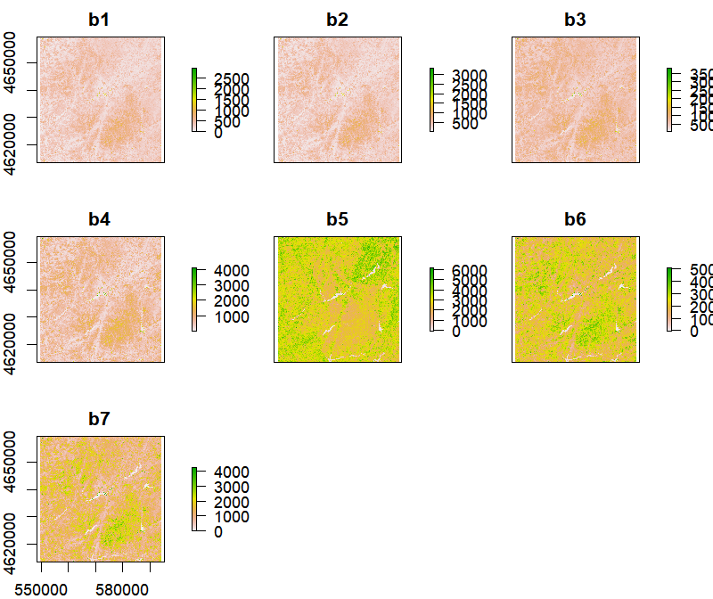
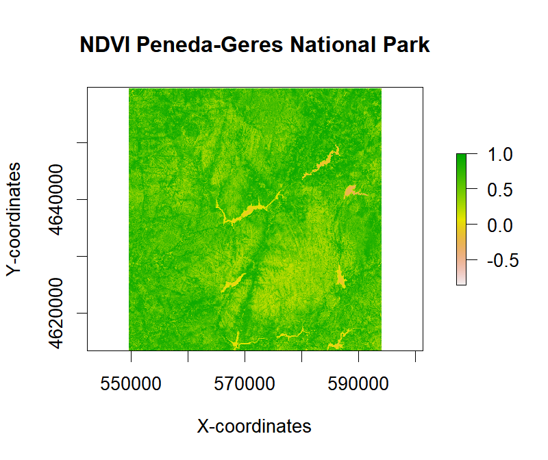
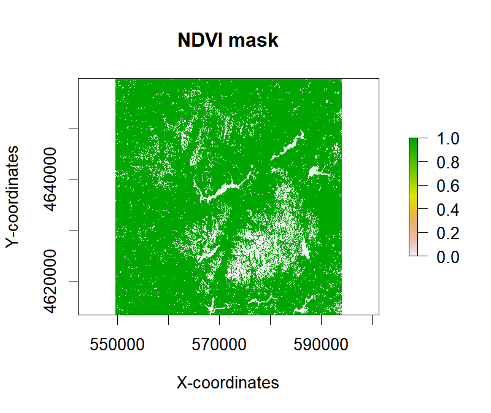

```{r setup, include=FALSE}

knitr::opts_chunk$set(echo = TRUE)
knitr::opts_chunk$set(fig.path = "img/")
knitr::opts_chunk$set(fig.width = 5, fig.height = 4.2, dpi = 80)

```

### Background 

-------------------------------------------------------------------------------------------------------

In the second part of this tutorial series on spatial data analysis using the `raster` package, 
we will explore new functionalities, namely:        
    
   * Raster algebra,    
   * Cropping    
   * Resampling, and,    
   * Reprojection.     

We will also introduce a new type of object named `RasterStack`, which, in its essence, is a collection of 
`RasterLayer` objects with the same spatial extent, resolution and coordinate reference system (CRS). 

For more information information on raster data processing see [here](http://r-exercises.com/tags/raster-data) 
and [here](https://www.r-exercises.com/2017/11/29/spatial-data-analysis-introduction-to-raster-processing-part-1). 


### RasterStack objects and Raster algebra

-------------------------------------------------------------------------------------------------------

We will start this tutorial by downloading sample raster data and creating a `RasterStack` composed 
by multiple image files. One satellite image from [Landsat 8](https://landsat.gsfc.nasa.gov/landsat-8/landsat-8-bands/) 
will be used for this purpose. The data contains [surface reflectance](http://glcf.umd.edu/data/gls_SR/) 
information for seven spectral bands (or layers, following the terminology for `RasterStack` objects) 
in GeoTIFF file format.    

The following table summarizes info on Landsat 8 spectral bands.     


Band #   | Band name                      | Wavelength (micrometers)
-------- | ------------------------------ | -------------------------
Band 1   | Ultra Blue                     | 0.435 - 0.451
Band 2   | Blue                           | 0.452 - 0.512 
Band 3   | Green 	                        | 0.533 - 0.590
Band 4   | Red 	                          | 0.636 - 0.673
Band 5   | Near Infrared (NIR) 	          | 0.851 - 0.879
Band 6   | Shortwave Infrared (SWIR) 1    | 1.566 - 1.651
Band 7   | Shortwave Infrared (SWIR) 2    | 2.107 - 2.294


Landsat 8 spatial resolution (or pixel size) is 30 meters. Valid reflecance decimal values 
are typically within 0.00 - 1.00 but, for decreasing file size, the valid range is multiplied 
by a 10^4^ factor to be in integer range 0 - 10000. Image acqusition date is the 15^th^ of July 2015.

```{r package_call}

library(raster)

```

```{r raster_input, eval=FALSE, echo=TRUE, message=FALSE, warning=FALSE}

library(raster)

## Create a folder named data-raw inside the working directory to place downloaded data
if(!dir.exists("./data-raw")) dir.create("./data-raw")

## If you run into download problems try changing: method = "wget"
download.file("https://raw.githubusercontent.com/joaofgoncalves/R_exercises_raster_tutorial/master/data/LT8_PNPG.zip", "./data-raw/LT8_PNPG.zip", method = "auto")

## Uncompress the zip file
unzip("./data-raw/LT8_PNPG.zip", exdir = "./data-raw")

```

With the data downloaded and uncompressed we can now generate a `RasterStack` object. The `stack` function 
accepts a character vector as input containing the paths to each raster layer. To generate this we will 
use the `list.files` function.

```{r make_raster_stack}

# Get file paths and check/print the list
fp <- list.files(path = "./data-raw", pattern = ".tif$", full.names = TRUE)
print(fp)

# Create the raster stack and print basic info 
rst <- stack(fp)
print(rst)

```

Changing raster layer names (usually difficult to read, as we saw above) is really straightforward. 
Also, if necessary, using simple names makes it easier to access layers by name in the `RasterStack`.

```{r change_raster_layer_names}

names(rst) <- paste("b",1:7,sep="")

```

Let's check if the data is being stored in memory:

```{r rst_in_mem}

inMemory(rst)

```

Similarly `RasterLayer` objects, by default (and unless necessary), a `RasterStack` object only holds 
metadata and connections to the actual data to spare memory.       

Plot the data for a fast visualization.

```{r plot_data, include=FALSE}

plot(rst)

```

https://raw.githubusercontent.com/joaofgoncalves/R_exercises_raster_tutorial/master



Notice how each layer has a separated tile in the plot.    

Now we can proceed to doing some raster algebra calculations. We will accomplish this by using three 
different methods: (i) direct, (ii) `calc` function, and, (iii) `overlay` function. In this example we 
will calculate the Normalized Difference Vegetation Index (NDVI) using the red (b4) and the 
near-infrared (NIR; b5) bands as: NDVI = (NIR - Red) / (NIR + red)


__.: Method #1__ (direct)

This method allows to directly use the raster layers in the stack called by their indices (or names). 
Typical operands (e.g., `+`, `-`, `/`, `*`) can be used, as well, as functions (e.g., `sqrt`, `log`, `cos`).
However, since processing occurs all at once in memory, you must be sure that your data fits into RAM. 

```{r raster_algebra_direct_method}

# Calling raster layers by index
ndvi <- (rst[[5]] - rst[[4]]) / (rst[[5]] + rst[[4]])

# Or calling by name
ndvi <- (rst[["b5"]] - rst[["b4"]]) / (rst[["b5"]] + rst[["b4"]])

```

Notice how the data type of the input rasters and the final raster (a ratio) are different (from integer 
to float; see ?dataType for details):

```{r in_vs_out_data_types}

dataType(rst)

dataType(ndvi)

```


__.: Method #2__ (calc function)

For large objects `calc` will compute values by raster chunks thus saving memory. This means that for the 
result of the defined function to be correct it should not depend on having access to all values at once.

```{r raster_algebra_calc_func}

calcNDVI_1 <- function(x) return((x[[5]] - x[[4]]) / (x[[5]] + x[[4]]))

ndvi1 <- calc(rst, fun = calcNDVI_1)

```


__.: Method #3__ (overlay function)

The overlay function allows to combine two (or more) `Raster*` objects and it should be more efficient when 
using large raster datasets that cannot be loaded into memory (similarly to `calc`).

```{r raster_algebra_overlay_func}

calcNDVI2 <- function(x, y) return((x - y) / (x + y))

ndvi2 <- overlay(x = rst[[5]], y = rst[[4]], fun = calcNDVI2)

```

Overall, using the first method is not advisable in cases were raster data is "big". For those cases, 
it is recommendable to use more "memory-friendly" methods such as `calc` or `overlay`. Also, as a 
general rule, if a calculation needs to use multiple individual layers separately (sometimes in 
different objects) it will be easier to set up in `overlay` rather than in `calc`.     

Plotting the NDVI data requires some fine tunning because some 'strange' values appeared. Note that 
NDVI range is between -1.00 and 1.00. In the summary below notice how 'resistant' measures (quartiles) 
are fine. Values closer to 1 mean higher vegetation cover.

```{r ndvi_range, include = FALSE}

# NDVI summary
summary(ndvi)

# Set values outside the 'normal' range as NA's
# Indexing for RasterLayers works similarly to matrix or data frame objects
ndvi[ndvi < -1] <- NA
ndvi[ndvi > 1] <- NA

# Plot NDVI
plot(ndvi)

```

https://raw.githubusercontent.com/joaofgoncalves/R_exercises_raster_tutorial/master



It is also fairly easy to perform logical operations. For example creating a NDVI mask with values 
above 0.4:

```{r raster_algebra_logical_ops, include=FALSE}

ndviMask <- ndvi > 0.4

plot(ndviMask, main="NDVI mask", xlab = "X-coordinates", ylab = "Y-coordinates")

```

https://raw.githubusercontent.com/joaofgoncalves/R_exercises_raster_tutorial/master




This creates a new boolean raster with 0's for pixels that are equal or below 0.4, and, 1's for values above 0.4. 
Pretty useful for separating vegetated from non-vegetated surfaces.


### Raster cropping

-------------------------------------------------------------------------------------------------------

Often we want to crop (or clip) a raster data set for a specific area of study. For doing that, the `raster` 
package uses the `crop` function which accepts as input a `Raster*` object and an `Extent` object used to define 
the new bounding coordinates (see `?extent` for more details).

```{r raster_cropping}

# Bounding coordinates
xmin <- 554615 #xmin(rst) + 5000
xmax <- 589015 #xmax(rst) - 5000
ymin <- 4618355 #ymin(rst) + 5000
ymax <- 4654705 #ymax(rst) - 5000

# Create the extent object by defining the bounding coordinates
newExtent <- extent(xmin, xmax, ymin, ymax)

# Crop
cropRst <- crop(rst, newExtent)

```


### Raster resampling

-------------------------------------------------------------------------------------------------------


### Raster reprojection

-------------------------------------------------------------------------------------------------------


